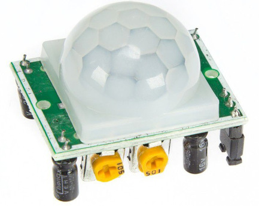
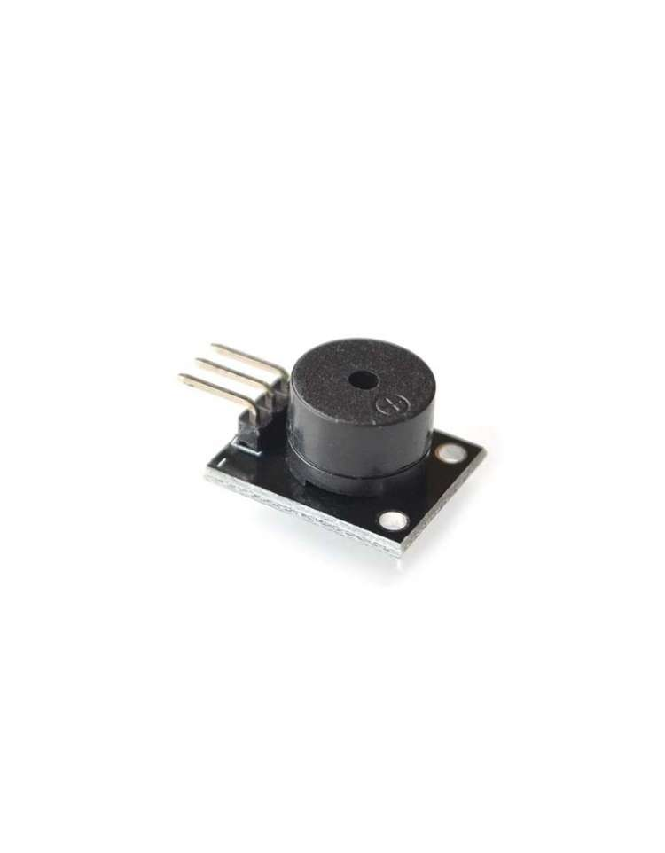
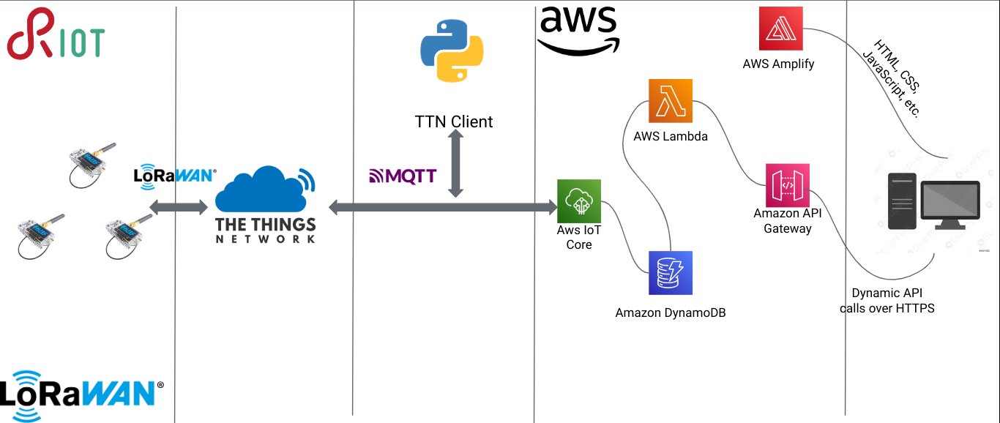

# HomeDefender
Internet of things project: Individual assignement

HomeDefender is an IoT project designed to detect movement inside in our house when we are out. The system uses an ESP32 Heltec LoRa32 V2 board, Riot OS, and AWS IoT Core, DynamoDB, MQTT, and Wi-Fi connection to communicate and store data. 

I decided to create this device in order to detect suspect movement in our apartment when we are not there. Additionally, this is a cheap system instead the soluntion just on the market.

When it is used: the system is enabled simply connecting it to a power source like a powerbank or the home plug. When it is active the pir sensor take over all the movemtents and the board will send the detection to the client, and activate the buzzer and the board led.

## Components

### Board

#### ESP32 Heltec LoRa32 v2
 
The Heltec LoRa32 v2 is a development board with 8 MB Flash that uses the EPS32 chip directly. It integrates:
- a SemTech SX1276 or SX1278 for LoRaWAN communication and
- a SSD1306 0.96-inch 128x64 OLED display connected via I2C. 

### Sensors

#### HC-SR501 Pir Sensor Module
 
The HC-SR501 PIR motion sensor is one of the easiest to connect to an Arduino -or any
other microcontroller for that matter- and can also be used as a stand alone motion
detector.
The HC-SR501 board has 2 variable resistors: looking at the back, with the connections
facing upwards and the variable resistors at the bottom, the left resistor is for
sensitivity and the right one is for output timing. for the sensitivity goes:
Clockwise=>High sensitivity CCW=> low sensitivity (3-7 m). for the Output timing it is
CW=>long, CCW=> short (3-300 sec) The right prong of the connector is for Vcc (+5-
20V), the middle one is signal out and the left one is ground. The output is either high
(3.3V) or low (0v)

#### Specification
- Voltage: 5V
- Power Consumption: 65 mA
- TTL output: 3.3V, 0 V
- Trigger methods: L – disable repeat trigger, H enable repeat trigger
- Sensing range: less than 120 degree, within 7 meters
- Temperature: – 15 ~ +70

### Actuators

#### Buzzer
 
This module is similar with the Active Buzzer Module , the only difference is that this
module only can be driven square wave signal, not DC signal.
Here the “source” does not mean power. But rather refers to the shock source
(Frequency). In other words, the active internal buzzer with shock source. The passive
internal sources without shocks, so if a DC signal can not make it tweet. Must 2K ~ 5K
square wave to Drive it.

#### Specification
- Operating Voltage 3.5V ~ 5.5V
- Maximum Current 30mA / 5VDC
- Minimum Sound Output 85dB @ 10cm
- Resonant Frequency	2500 ±300 Hz
- Operating Temperature	-20°C to 45°C


## Architecture

The circuit is the following:


## Network Architecture



### IoT Devices with RIOT OS
The home defender system utilizes IoT devices equipped with the RIOT OS (Real-Time Operating System). These devices, such as the ESP32 v2 Heltec LoRa board, incorporate the necessary hardware components, to monitor the area effectively. RIOT OS provides a lightweight and efficient operating system tailored for resource-constrained IoT devices, ensuring optimal performance and low power consumption.

### The Things Network (TTN)
The Things Network plays a crucial role in the home defender system's network architecture. TTN serves as the LoRaWAN infrastructure provider, enabling secure and reliable communication between the IoT devices and the cloud service. It facilitates the seamless transmission of location data from the IoT devices to the cloud service, ensuring efficient data flow and connectivity.

### Amazon Web Services

The home defender system leverages several components within the AWS ecosystem to enable data storage, processing, and web interface access. The components utilized include:

- AWS IoT Core: It serves as the central hub for communication between the pet tracking devices and the cloud service. AWS IoT Core enables secure and reliable data exchange and facilitates seamless integration with other AWS services.

- DynamoDB: This NoSQL database service is employed for storing the pet's location data. DynamoDB offers scalability, high performance, and low latency access, ensuring efficient storage and retrieval of location data.

- Lambda Functions: AWS Lambda functions are utilized to perform various operations on the pet's location data, including encryption, decryption, and data processing. These serverless functions enable real-time data manipulation and facilitate seamless integration with other AWS services.

- Amplify: AWS Amplify simplifies the development process by providing a set of tools and services for building scalable and secure web applications. It enables the creation of a user-friendly web interface for pet owners to access real-time location data and receive alerts.

- API Gateway: AWS API Gateway acts as the entry point for the web interface, providing a secure and scalable API endpoint. It enables seamless communication between the web interface and the backend services, ensuring a smooth user experience.

## How to run

### Prerequisites

- Docker
- AWS account
- Mosquitto
- [Bridge Mosquitto MQTT Broker to IoT](https://aws.amazon.com/it/blogs/iot/how-to-bridge-mosquitto-mqtt-broker-to-aws-iot/)

### How to use the code
Clone the repository
```
https://github.com/TheChemistWhite/HomeDefender.git
```

## Wi-fi

### Setup

You first need to add your AWS certificates in the `wifi_code/Paho Python Client` folder, the following are needed:
- `Paho Python Client/root-CA.crt`
- `Paho Python Client/<name>.private.key`
- `Paho Python Client/<name>.cert.pem`

Moreover be sure to have `pyconfig` installed. You have to add also a pyconfig.py file in which you have to define the relative path of those certificates along with your AWS endpoint and your broker address. 

### Configuration

First of all you have to start mosquitto with the following command inside its folder: `./broker_mqtts broker.conf`.

Then, you have to go in `wifi_code/Paho Python Client` and run the following command: `python3 MQTTClient.py`.

Finally you have to modify the IP address inside the `wifi/main.c` file, and you have to edit the `WIFI_SSID` and `WIFI_PASS` with your hotspot wi-fi.

### Run

Now, you can flash the board. Locate yourself in `src/wi-fi` and use the command `sudo BOARD=esp32-heltec-lora32-v2 BUILD_IN_DOCKER=1 DOCKER="sudo docker" PORT="/dev/ttyUSB0" make all flash term`

## LoRa

### Run

For the LoRa part, you have simply to run `sudo BOARD=? BUILD_IN_DOCKER=1 DOCKER="sudo docker" PORT="/dev/ttyUSB0" make all flash term` substitue the '?' with your board (it doesn't work for the esp32-heltec-lora32-v2 board).

## Link
- [Blog Post]()
